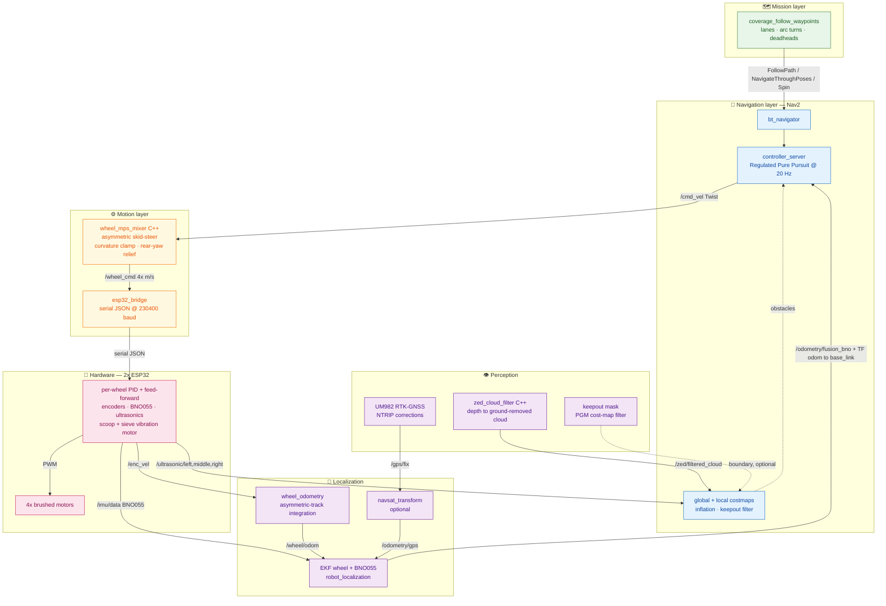
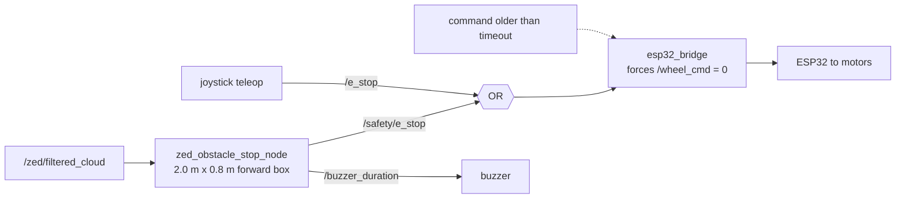
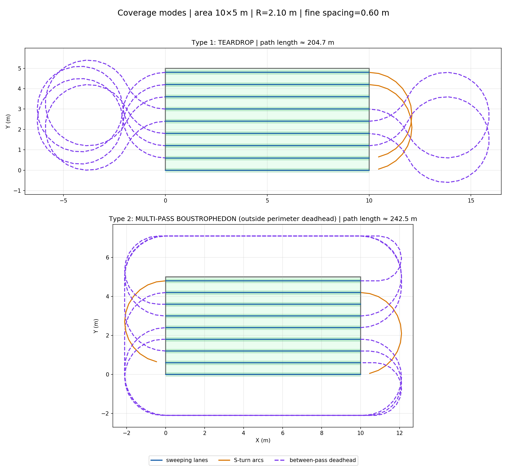
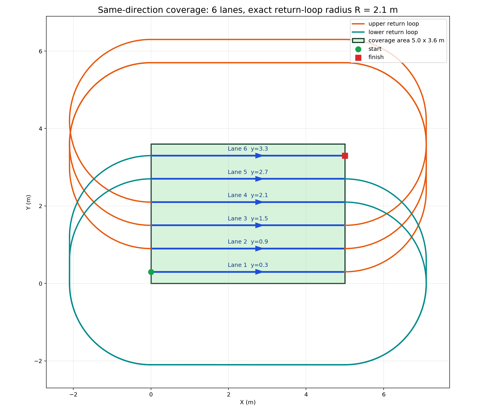
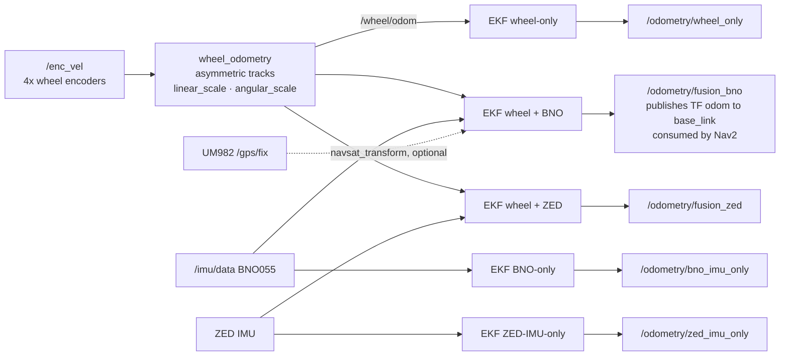

# 🏖️ Autonomous Beach-Cleaning Robot

> A full-coverage autonomous cleaning robot built on **ROS 2**, running entirely on-board a **Jetson Nano Super**.
> It plans a lawnmower (boustrophedon) sweep over a rectangular beach area, follows it with **Nav2**, fuses
> wheel odometry + IMU + **RTK-GNSS** for localization, and stops for obstacles seen by a **ZED depth camera**
> and ultrasonic sensors — while a custom skid-steer mixer drives an **asymmetric 4-wheel** platform over loose sand.


**Contents** ·
[Overview](#overview) ·
[System overview](#system-overview) ·
[Coverage planner](#coverage-planner) ·
[Localization](#localization) ·
[Safety](#safety-chain) ·
[Hardware](#hardware) ·
[Packages](#software-packages) ·
[Field results](#field-results--tuning) ·
[Build](#build) ·
[Run](#run)

---

## Overview

The robot autonomously cleans a defined rectangular zone of a beach. Given the zone's dimensions and a start
corner, a custom planner generates the sweeping lanes, end-of-lane turns and between-pass repositioning moves,
then drives them through Nav2 while a C++ skid-steer mixer and two ESP32 micro-controllers translate body
velocity into per-wheel motor control. A scoop under the chassis lifts sand + trash, and a vibration-motor
sieve separates the trash from the sand.

The project is **mapless**: no SLAM and no prior environment map. The work area is defined numerically at
launch, boundaries are optionally enforced with a lightweight black/white **cost-map mask**, and global
localization comes from **RTK-GNSS** fused with wheel odometry and an IMU.

### Engineering highlights

- **Custom full-coverage planner** — boustrophedon and spiral patterns with configurable lane spacing, arc or
  in-place-pivot turns, interleaved multi-pass coverage, and three between-pass "deadhead" repositioning
  strategies (outside loop / direct / rounded).
- **Lanes bypass the global planner.** Lanes are executed through Nav2's `FollowPath` action so the controller
  tracks the *exact* lane line; NavFn is never allowed to reshape a straight sweep into a diagonal. Turns run as
  `NavigateThroughPoses` arcs and pivots as `Spin`.
- **Asymmetric skid-steer kinematics** — the platform is *not* symmetric (narrow caterpillar front wheels at
  0.734 m track, wide round rear wheels at 1.179 m track). A dedicated C++ mixer handles the differing track
  widths, per-wheel velocity ceilings, a curvature clamp, and a *rear-yaw-relief* term that stops the wide rear
  wheels from fighting the front tracks in a turn.
- **Parallel EKF bank** — five EKFs run at once (wheel-only, BNO-only, ZED-IMU-only, wheel+BNO,
  wheel+ZED) so sensor combinations can be compared on the same drive from one recorded bag. `wheel+BNO` is the
  one that owns the `odom → base_link` transform.
- **Independent safety layer** — a ZED obstacle-stop node drives a hardware-level E-stop that is OR-ed with the
  joystick E-stop *inside the serial bridge*, so it zeroes the wheels regardless of what Nav2, teleop, or the
  mixer are outputting.
- **Field-tuned on real terrain** — odometry scale, PID gains, and turn geometry were characterized and re-tuned
  separately for **loose sand** and **indoor tile** with purpose-built analysis tools and recorded bags
  (see [Field results](#field-results--tuning)).

---

## System overview

Command flows top-to-bottom; sensor feedback flows back up into the EKF and the cost-maps.



**Command path:** planner → Nav2 → mixer → serial bridge → ESP32 → motors.
**Feedback path:** encoders + IMU (+ GNSS) → EKF → `odom → base_link` → Nav2.

### Rate budget

| Stage | Rate | Set in |
|-------|------|--------|
| Nav2 controller (`/cmd_vel`) | 20 Hz | `nav2_params_*.yaml` |
| Mixer (`/wheel_cmd`) | 50 Hz | `beach_wheel_mixer/config/mixer.yaml` |
| Serial bridge → ESP32 | 20 Hz (configurable) | `wheel_cmd_send_rate_hz` |
| ESP32 PID control loop | 100 Hz | firmware `CONTROL_HZ` |
| ESP32 → host telemetry | 10 Hz | firmware `TELEMETRY_PERIOD_MS` |
| Stale-command failsafe | 0.3–0.5 s → zero wheels | mixer `cmd_timeout_ms` + bridge |

### Safety chain

Three independent layers can stop the robot; the lowest one is enforced in the serial bridge, below Nav2 and
below the mixer, so a planner or controller fault cannot override it.



The obstacle-stop node runs as a **separate** launch file (`zed_obstacle_stop.launch.py`) rather than inside the
coverage node, so it keeps guarding every Nav2 phase — lanes, turns, deadheads and recoveries alike. Nav2's
`movement_time_allowance` is deliberately long so a safety hold pauses the robot without failing the goal.

---

## Coverage planner

The planner turns a rectangle into an executable path: sweeping lanes, feasible end-of-lane turns, and
between-pass repositioning. Both trade-offs below are produced by the same node and previewed before any motion.



*Two coverage modes over a 10 × 5 m area at turn radius R = 2.10 m and 0.60 m fine spacing. Teardrop keeps turns
compact (≈ 204.7 m of path); multi-pass boustrophedon with an outside-perimeter deadhead keeps every lane swept
in the same direction at the cost of a longer route (≈ 242.5 m).*



*Same-direction mode over 5 × 3.6 m: every lane is swept left-to-right and the robot returns on an exact-radius
loop outside the work area — the pattern used when the cleaning tool only works in one travel direction.*

### How it works

1. **Generate lanes.** From the rectangle, lane spacing and boundary margin, the planner lays parallel lanes
   along the long axis (kept parallel to the shoreline, so the robot makes few long passes and turns only at the
   ends).
2. **Sweep.** Lanes are traversed back-and-forth (boustrophedon) or all in the same direction, depending on
   `coverage_path_mode`.
3. **Turns.** At each lane end the planner inserts an **arc** (radius = `turn_radius`) or an in-place **corner**
   pivot — chosen per surface, because the achievable radius is a property of the ground, not of the planner.
4. **Multi-pass overlap.** For full coverage the tool lays fine interleaved lanes at `lane_spacing / num_passes`;
   fewer passes trade coverage for speed.
5. **Deadheads.** Between passes the robot repositions with a configurable style: loop **outside** the area,
   drive **direct** (straight + in-place rotates), or a **rounded** arc path that stays inside.
6. **Execute.** Lanes go out as `FollowPath` goals so the controller tracks the exact line; turns go out as
   `NavigateThroughPoses`; pivots as `Spin`. Nav2 handles obstacle avoidance and recovery throughout.

Preview the whole path as a `nav_msgs/Path` on `/coverage/path_viz` (plus the work-area boundary marker on
`/coverage/area_boundary`) *before* enabling motion — that is what `start_coverage:=false` is for.

### Why the turn radius is the hard constraint

A 4-wheel skid-steer robot cannot turn tighter than its geometry and the ground friction allow, and the failure
mode flips with the surface:

| Surface | Failure mode when the arc is too tight | Practical floor |
|---------|----------------------------------------|-----------------|
| Loose sand | rear round wheels slip, robot under-rotates and drifts wide | **1.8 m** |
| Indoor tile | inside front track stalls, front and rear fight each other | **0.6 m** |

R is measured to the robot centre, and half-track is 0.367 m front / 0.59 m rear — so any commanded radius below
those forces an inside wheel to reverse. That is a skid pivot, not a rolling arc. The tooling therefore judges an
arc "clean" by **inside-front encoder speed ≥ 0.12 m/s**, a metric read from the encoders and gyro so that wheel
slip cannot flatter the result.

---

## Localization

No SLAM. Instead, five `robot_localization` EKFs run side by side on the same inputs, which makes it possible to
compare sensor combinations on a single recorded drive:



**Heading comes from the BNO055, not from the wheels.** Wheel-odometry yaw error on this platform is slip-driven
and left/right asymmetric — correcting it would need an angular scale of 1.055 for left turns but 1.166 for right
turns, so no single scalar fixes it. `angular_scale` is deliberately left at **1.0** and the EKF down-weights
wheel yaw whenever the IMU is present.

---

## Hardware

| Component | Detail |
|-----------|--------|
| Compute | NVIDIA Jetson Nano Super — runs the full ROS 2 stack on-board |
| Micro-controllers | 2× ESP32 — per-wheel PID, encoders, IMU, ultrasonics, scoop/sieve actuation |
| Drivetrain | 4 wheels — front: caterpillar/track (narrow), rear: round (wider) |
| GNSS | UM982, RTK-capable, NTRIP corrections |
| IMU | BNO055 (heading authority, read via ESP32) |
| Depth camera | ZED Mini — depth cloud → obstacle layer + stop box |
| Ultrasonic | 3× HC-SR04 (left / middle / right, close-range safety) |
| Teleop | 2.4 GHz joystick receiver — manual override and E-stop |
| Cleaning mechanism | Under-chassis scoop + vibration-motor sieve |
| Host link | `/dev/ttyESP32` @ 230400 baud, JSON line protocol |

### Drivetrain geometry (asymmetric)

| Wheels | Type | Track width | Max wheel speed |
|--------|------|-------------|-----------------|
| Front (FL / FR) | Caterpillar | 0.734 m | 1.25 / 1.10 m/s |
| Rear (RL / RR) | Round | 1.179 m | 9.70 / 8.60 m/s |

Wheelbase **0.950 m**. The asymmetry — different track widths, different tyre types, and rear wheels behind a
chain reduction — is the core design constraint that the mixer, the odometry model and the turn tuning are all
built around.

---

## Software packages

| Package | Language | Responsibility |
|---------|----------|----------------|
| `beach_robot_coverage_nav2` | Python | Coverage planner, Nav2 bringup, keepout-mask generation, ZED obstacle-stop safety node |
| `beach_robot_localization` | Python | Wheel odometry, the EKF bank, GNSS fusion, static sensor TFs |
| `beach_wheel_mixer` | **C++** | `/cmd_vel` → per-wheel velocity; asymmetric skid-steer kinematics |
| `beach_robot_esp32_bridge` | Python | Serial JSON protocol to/from the ESP32s, E-stop enforcement, encoder spike filter |
| `beach_robot_gnss` | Python | UM982 driver, NTRIP client, RTK state reporting |
| `zed_nav2_cloud_filter` | **C++** | ZED depth cloud → filtered obstacle cloud for Nav2 |
| `beach_robot_bringup` | Python | Hardware orchestration, systemd/udev deployment, analysis + tuning tools |
| `beach_robot_teleop` | Python | Joystick teleop, manual override, E-stop |
| `beach_robot_description` | XML | URDF / robot description |
| `beach_robot_sim` | Python | Gazebo simulation launcher |
| `beach_robot_interfaces` | — | Custom ROS 2 messages / actions |
| `zed-ros2-wrapper` | C++ | Stereolabs ZED driver (external submodule) |
| `firmware/` | C++ | ESP32 source, kept in-tree for reference; flashed with PlatformIO |

### Analysis & tuning tools

Tuning this platform needed measurements rather than guesses, so the tools are part of the repo:

| Tool | Purpose |
|------|---------|
| `preflight_check` | Verifies every required topic is alive before a run |
| `turn_radius_test` | Drives one arc (or in-place pivot) and logs per-tick encoder + gyro data |
| `analyze_turn_radius` | Cross-run comparison → tightest *clean* radius per direction, flags mixer clamps |
| `drive_straight_odom` | Commanded straight drive for odometry-scale calibration |
| `wheel_response_test` / `analyze_wheel_response` | Per-wheel step response |
| `analyze_spin_tune` | Angular-velocity tuning analysis |
| `localization_pose_report` | Post-processes a bag → pose-accuracy CSV/SVG per sensor combination |
| `coverage_bag_report` | Post-processes a coverage bag → per-lane and per-turn tracking-error tables |

---

## Field results & tuning

Everything below was measured on the real robot with the tools above, then locked into config.

| What | Result | How it was measured |
|------|--------|---------------------|
| Wheel-odometry scale, sand | `linear_scale` **1.19** | 10 m of odometry vs 8.245 m taped ⇒ ≈ 21 % slip |
| Wheel-odometry scale, tile | `linear_scale` **1.625** | 4.87 m taped at 5.0 m odometry |
| Heading source | BNO055; `angular_scale` fixed at **1.0** | Wheel yaw needs 1.055 left / 1.166 right — no single scalar works |
| Loop-closure error, right circle | wheel-odom **1.09 m** → fused **0.25 m** | Taped 360° circle test |
| Tightest clean arc, sand | **1.8 m** | Radius sweep; inside-front encoder ≥ 0.12 m/s |
| Tightest clean arc, tile | **0.6 m** (achieved L 0.611 / R 0.599) | Same sweep with `mixer_turn06.yaml` |
| Low-speed stutter | fixed by lowering ESP32 `ACTIVE_U_FLOOR` 0.22 → 0.12 (front) | Stick-slip observed on sand |
| Sustained-load climb | fixed by raising PID `Ki` to 0.08 (front) | Hill / soft-sand load test |
| Off-lane `/plan` drift | fixed by `waypoint_step` 0.50 → 0.30 m | NavFn was diagonal-offsetting up to 0.3 m between sparse poses |

The left/right asymmetry is real and repeatable: right turns come out ~0.04 m tighter than left at
`turn_gain_front` 1.6, shrinking to 0.012 m at 1.5. Rather than hide it behind a fudge factor it is documented,
and the heading estimate is taken from the IMU instead.

---

## Build

Developed on a laptop, deployed to the Jetson with `git pull` + `colcon build`.

> On the Jetson Nano (limited RAM) build **sequentially**, or the compiler runs out of memory:

```bash
git submodule update --init --recursive
MAKEFLAGS="-j1" colcon build --symlink-install --executor sequential
source install/setup.bash
```

Rebuild a single package after a change (much faster):

```bash
colcon build --symlink-install --executor sequential --packages-select beach_robot_coverage_nav2
```

**Requirements:** ROS 2 Humble, `nav2_bringup`, `robot_localization`, ZED SDK (or run with `use_zed:=false`),
`pyserial`, `pynmea2`.

---

## Run

### 1. Preview the path — no motion

Visualize `/coverage/path_viz` in RViz2 (type `Path`, frame `map`) and confirm the lanes, turns and deadheads
before letting the robot move.

```bash
ros2 launch beach_robot_coverage_nav2 beach_cleaning_bringup.launch.py start_coverage:=false area_width:=10.0 area_height:=5.0 turn_radius:=2.10 lane_spacing:=0.60 tool_width:=0.60
```

### 2. Autonomous cleaning run

```bash
ros2 launch beach_robot_coverage_nav2 beach_cleaning_bringup.launch.py start_coverage:=true area_width:=10.0 area_height:=5.0 turn_radius:=2.10 lane_spacing:=0.60 tool_width:=0.60
```

### 3. Drivetrain only — no Nav2 (used for all tuning)

```bash
ros2 launch beach_robot_localization localization_full_test.launch.py
```

### 4. Obstacle-stop safety node (separate, guards every phase)

```bash
ros2 launch beach_robot_coverage_nav2 zed_obstacle_stop.launch.py
```

### Key launch arguments

| Argument | Default | Meaning |
|----------|---------|---------|
| `area_width` / `area_height` | `5.0` / `3.6` m | Work rectangle; width is the long (lane) axis |
| `tool_width` | `0.60` m | Cleaning-tool width |
| `lane_spacing` | `0.60` m | In-pass lane spacing |
| `turn_radius` | `2.10` m | End-of-lane arc radius — surface-dependent, see [above](#why-the-turn-radius-is-the-hard-constraint) |
| `num_passes` | `1` | Interleaved passes; fine spacing becomes `lane_spacing / num_passes` |
| `coverage_path_mode` | `same_direction_loops` | `same_direction_loops` / `teardrop` / `multipass_boustrophedon` |
| `deadhead_style` | `outside` | Between-pass reposition: `outside` / `direct` / `rounded` |
| `waypoint_step` | `0.30` m | Waypoint density along a lane |
| `start_coverage` | `true` | `false` = preview the path only |
| `start_delay_sec` | `15.0` | Wait for Nav2 to become active before sending goals |
| `use_keepout` | `false` | `true` enables the boundary / keepout mask filter |
| `use_zed` | `true` | `false` = ultrasonics only |
| `use_gnss` | `false` | `true` publishes `/gps/fix` + `/odometry/gps` |
| `linear_scale` | `1.625` | Wheel-odometry scale — **1.19 on sand** |

### RTK-GNSS setup

NTRIP credentials are read from the environment, never committed:

```bash
export NTRIP_HOST=rtk2go.com NTRIP_MOUNTPOINT=YOUR_MOUNTPOINT NTRIP_USERNAME=your-caster-login NTRIP_PASSWORD=none
```

```bash
ros2 launch beach_robot_coverage_nav2 beach_cleaning_bringup.launch.py use_gnss:=true
```

### Key topics

| Topic | Type | Producer |
|-------|------|----------|
| `/cmd_vel` | `geometry_msgs/Twist` | Nav2 controller or teleop |
| `/wheel_cmd` | `std_msgs/Float32MultiArray` | `beach_wheel_mixer` |
| `/enc_vel` | `std_msgs/Float32MultiArray` | ESP32 bridge |
| `/wheel/odom` | `nav_msgs/Odometry` | `wheel_odometry` |
| `/odometry/fusion_bno` | `nav_msgs/Odometry` | EKF (wheel + BNO055) — Nav2's odom source |
| `/imu/data` | `sensor_msgs/Imu` | BNO055 via ESP32 |
| `/gps/fix`, `/gps/rtk_state` | `sensor_msgs/NavSatFix`, `std_msgs/String` | UM982 bridge |
| `/zed/filtered_cloud` | `sensor_msgs/PointCloud2` | `zed_cloud_filter` |
| `/ultrasonic/{left,middle,right}` | `sensor_msgs/Range` | ESP32 bridge |
| `/e_stop`, `/safety/e_stop` | `std_msgs/Bool` | Teleop, obstacle-stop node |
| `/coverage/path_viz` | `nav_msgs/Path` | Coverage planner (preview) |

---

## Repository structure

```
beach_robot_ws/
├── src/                              # ROS 2 packages (colcon workspace)
│   ├── beach_robot_coverage_nav2/        # Coverage planner + Nav2 bringup + safety node
│   ├── beach_robot_localization/         # Wheel odometry + EKF bank + GNSS fusion
│   ├── beach_wheel_mixer/                # cmd_vel → wheel_cmd (C++ skid-steer)
│   ├── beach_robot_esp32_bridge/         # Serial bridge to the ESP32s
│   ├── beach_robot_gnss/                 # UM982 GNSS driver + RTK/NTRIP
│   ├── zed_nav2_cloud_filter/            # ZED depth → obstacle layer (C++)
│   ├── beach_robot_bringup/              # Orchestration + analysis/tuning tools
│   ├── beach_robot_teleop/               # Joystick teleop
│   ├── beach_robot_description/          # URDF / robot description
│   ├── beach_robot_sim/                  # Gazebo simulation
│   ├── beach_robot_interfaces/           # Custom messages / actions
│   └── zed-ros2-wrapper/                 # Stereolabs ZED driver (submodule)
├── firmware/                         # ESP32 firmware source (flashed via PlatformIO)
├── coverage_previews/                # Generated coverage-path previews
└── docs/                             # Tuning guide + system walkthrough
```

---

## Documentation

- [`docs/ENGINEERING_NOTES.md`](docs/ENGINEERING_NOTES.md) — the working engineering reference: every tuned
  parameter with the test that produced it, the topic map, the field test procedures, and the known failure
  modes. This is the file to read if you want to see how the numbers in this README were arrived at.
- [`docs/sand_tuning_guide.md`](docs/sand_tuning_guide.md) — drivetrain and turn-tuning workflow for loose sand.
- [`docs/system_overview_th.md`](docs/system_overview_th.md) — end-to-end pipeline walkthrough (Thai).
- [`src/beach_robot_coverage_nav2/README.md`](src/beach_robot_coverage_nav2/README.md) — coverage-package notes.

---

## Tech stack

**ROS 2 Humble** · **Nav2** (Regulated Pure Pursuit, cost-map filters, behaviour trees) · **C++17** ·
**Python 3** · Extended Kalman Filter (`robot_localization`) · RTK-GNSS / NTRIP · ZED SDK · ESP32 firmware
(PID + serial JSON protocol) · Gazebo · systemd + udev deployment · NVIDIA Jetson.

---

## License

MIT — see [LICENSE](LICENSE).
